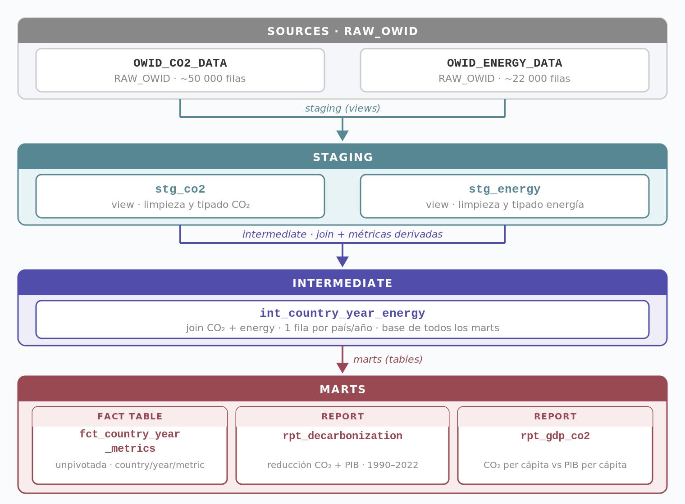

## Dataset

Datos públicos de **Our World in Data (OWID)**, con metodología equivalente a la del IPCC y la IEA: series de emisiones de CO₂ (`owid-co2-data`, ~50.000 registros) y de mix energético (`owid-energy-data`, ~22.000 registros) para más de 190 países. El análisis se acota a 1990 por las discontinuidades que introduce la disolución de la URSS en los datos de Europa del Este, y a 2022 por la disponibilidad de datos de PIB.

## Arquitectura

*Snowflake actúa como warehouse; dbt Core organiza la transformación en tres capas hasta la tabla de hechos que consume Tableau.*

`stg_co2` y `stg_energy` limpian y tipan cada fuente por separado. `int_country_year_energy` las cruza por país y año, y es la única base de la que derivan los tres marts: la tabla de hechos unpivotada (`fct_country_year_metrics`) y dos reports especializados en descarbonización y en la relación PIB–CO₂.

## Decisiones de diseño

**Carga directa a Snowflake, sin scripts intermedios.** Los CSV de OWID se importan tal cual a `RAW_OWID`; toda la limpieza, el tipado y el modelado ocurren después, versionados y testeados en dbt. Simplifica la ingesta y hace el pipeline reproducible desde una fuente pública, sin infraestructura adicional que mantener.

**Formato largo en la tabla de hechos.** `fct_country_year_metrics` unpivota 16 métricas a formato (country, year, metric, value) en vez de mantenerlas en columnas. Permite filtrar cualquier métrica en Tableau con un único parámetro dinámico, sin campos calculados por visualización — al coste de queries SQL menos directas fuera del dashboard.

**Un parámetro para alternar entre reducción porcentual y absoluta**, en vez de fijar una sola métrica de descarbonización.

## Dashboards

El proyecto culmina en dos dashboards interactivos desarrollados en Tableau, cada uno orientado a una pregunta analítica distinta.

### Dashboard 1 · Visión global

Permite analizar la evolución de las emisiones y del mix energético por país y década.

*Filtrar un país en el mapa actualiza el resto de gráficos mediante Dashboard Actions.*

**Qué permite responder**

- ¿Qué países concentran las mayores emisiones, en total y per cápita?
- ¿Qué ritmo de adopción de renovables presenta cada país?

### Dashboard 2 · Descarbonización

Analiza la reducción de emisiones desde dos perspectivas complementarias.

*Alternar el parámetro cambia el ranking por completo: Moldavia, Ucrania y Estonia lideran en porcentual por el colapso económico postsoviético; Rusia, Ucrania y Alemania lideran en absoluto por el volumen de CO₂ retirado.*

**Qué permite responder**

- ¿Qué países reducen más emisiones en términos absolutos y cuáles en términos porcentuales?
- ¿Existe desacoplamiento entre crecimiento económico y reducción de emisiones?
